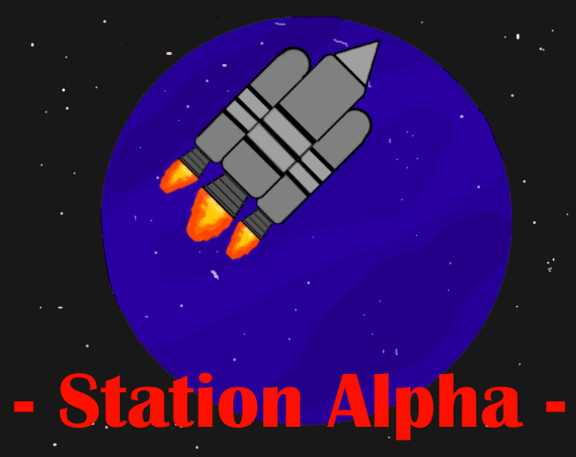
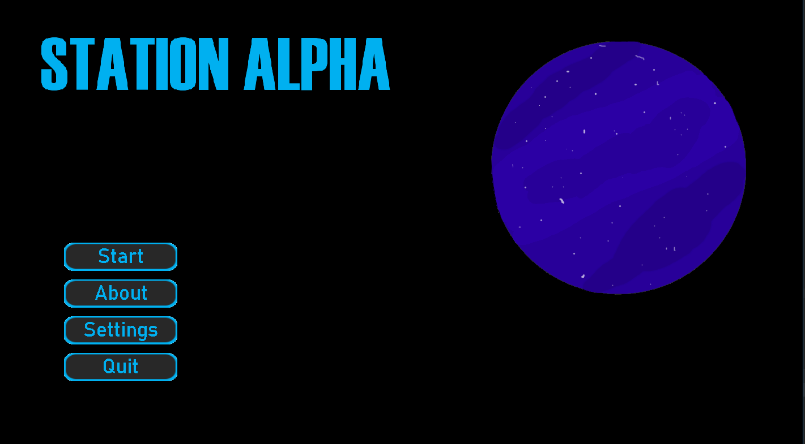
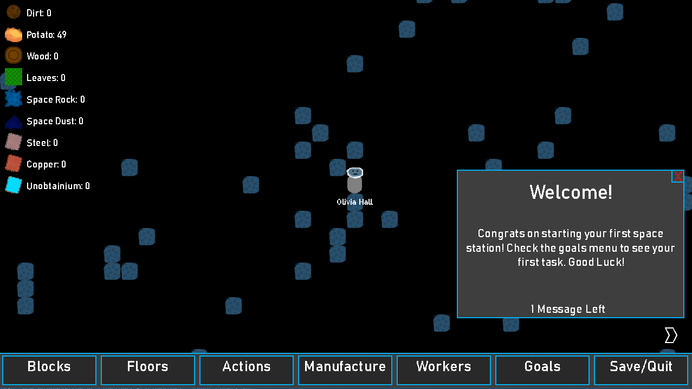
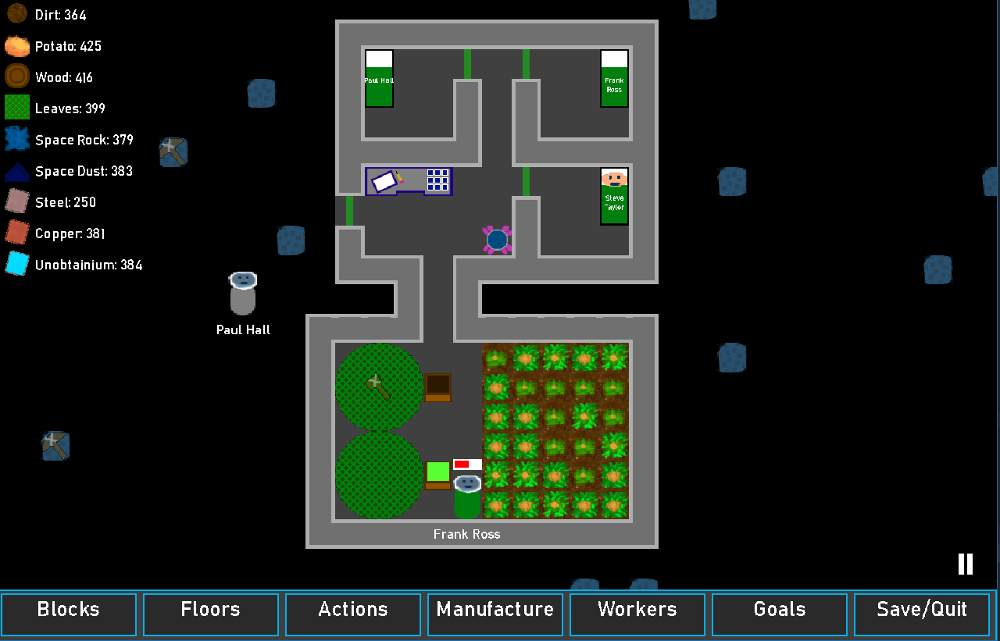
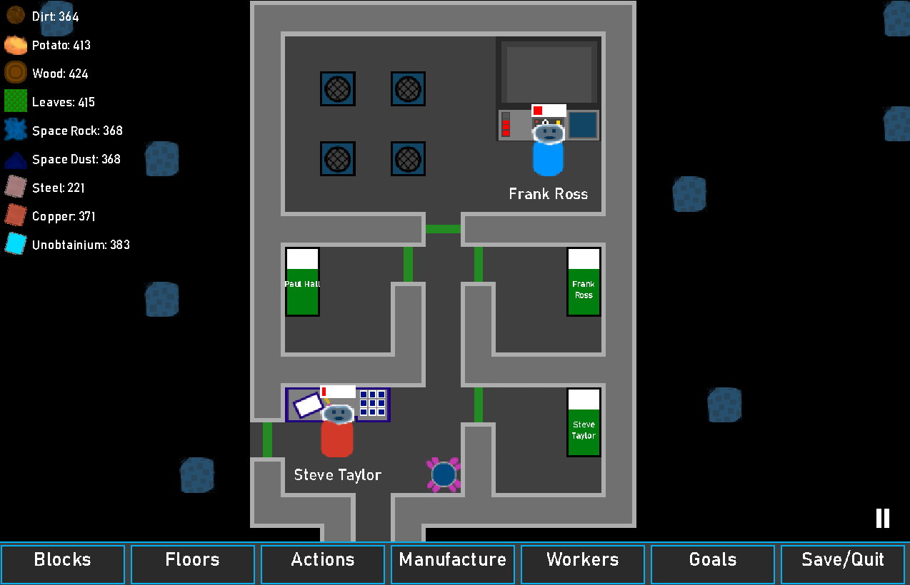

# StationAlpha [WIP]
A game where you build a space station

### [Download: Itch.io](https://devorc.itch.io/station-alpha)
### [Download: Github Releases](https://github.com/DevOrc/StationAlpha/releases)

## How to run from Source

Run the following command in the root folder

`gradlew desktop:run`

## Screen Shots

## Zulu
Zulu is a prototype GUI library for LibGDX written in Kotlin. 
The goal is to eventually integrate Zulu into StationAlpha (to replace the current GUI code)

To run the test run the following command:

`gradlew zulu:run`
